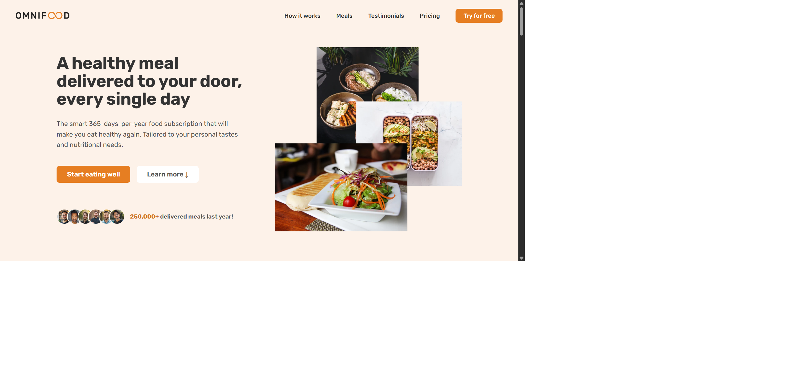

# Omnifood

A static landing page for a fictional food delivering company called "Omnifood", built using HTML, CSS, and simple Vanilla JavaScript code.



## Features

- **Responsive design:** this project was designed to be responsive for different devices: desktops, tablets, small tablets, and mobile phones, ensuring smooth navigation for smaller screens.
- **Interactive elements:** from navigation bar to call-to-action, the website incorporates animations, hovering effects, and dynamic navigation bar.
- **Accurate styling**: all design choices, such as typography, color shemes, and borders, have been carefully chosen to create an appropriate website for a startup.

## Live Demo

You can check a live demo here: [https://omnifood-healthy-ai-meals.netlify.app/](https://omnifood-healthy-ai-meals.netlify.app/)

## Technologies Used

- Semantic HTML5
- CSS flexbox
- CSS grid
- Vanilla JS
- Netlify forms

## Project Structures

```
Omnifood-Project/
|
├── index.html
├── css
| ├── general.css
| ├── style.css
| └── queries.css
|
├── js
| └── script.js
|
├── img
| └── (images, icons, and assets)
|
└── screenshot.png
```

## How to use

1. Clone the repository to your local machine:

```
git clone https://github.com/Ahmed-Shabasy/Omnifood-Project.git
```

3. Navigate to project directory:

```
cd Omnifood-Project
```

5. Open the `index.html` file using your web browser to see the website. <br>
   You can open it using CLI according to your device. For example, you run it on **windows** using:
   ```
   start index.html
   ```

## Feedback and contribution

Feel free to give feedback, suggestions, and contributions!

## Author

- **LinkedIn:** [https://www.linkedin.com/in/shabasy](https://www.linkedin.com/in/shabasy)
